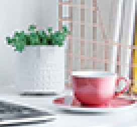

## Intro

PNG and JPEG are the two oldest formats that web developers use
to add images to their web pages. Web standards came a long way, and we use next generation formats, such as WebP/AVIF/JpegXL, to deliver an image to the end user. But JPEG and PNG are still the source of truth most of the time. 

In this article I'll explain why converting PNG to the next-gen format is not as straightforward and how we went about it.

We use Go and [MagickWand](https://imagemagick.org/script/magick-wand.php) library for the code snippets.  You can get the latest version of the library using [ImageMagick docker image](https://github.com/dooman87/imagemagick-docker).

Our opensource Image CDN ["transformimgs" that available on Github](https://github.com/Pixboost/transformimgs) is using the approach from this blog, and it works quite well in production.

Let's get to it!

## PNG

Let's see what the main difference between JPEG and PNG and when we use each.

* PNG is a [lossless format](https://en.wikipedia.org/wiki/Lossless_compression), meaning when you compress/uncompress the image it doesn't change. On the contrary, the result image is not the same when using JPEG. So, if it is important for us to display exactly the same image then PNG will be our choice. However, it's rarely a requirement for the Web. But, we still want our images to look good. JPEG could introduce visual artefacts to the image and it will be most visible on the images with fewer details and colors. Generally, it makes sense to use lossless compressions for the sharp images with few colors. The examples could be **logos, banners, illustrations**. We'll look at some examples in the next section

* PNG supports transparency. If you'd like to show background of the page on some parts of the image then you make those parts transparent. The popular use case is **product images** on online shops.

Keeping the above in mind it shouldn't be a problem to choose the format. Though, modern formats support both lossy and lossless encoding, and we can pick which one to use when transforming an image. Meaning if we used PNG for transparency then we still can encode it lossy. But how can we know that? 

So, here comes the ~~elephant~~ problem: 


When is it better to use lossy or lossless compression when converting PNG to the next generation format?


## Lossy or Lossless?

Lossy compressed images are smaller compared to lossless, but they also might have some visual artifacts and glitches. Let's take a look at some examples.

We use WebP format here because it's most adopted format and the article's images will show up in the most browsers. We used ImageMagick 7.1.0-10 to convert PNG to WebP: `magick image.png -define webp:lossless=true/false image.webp`.

### Example 1. Illustration

Original PNG image:


The original size of the image is **294Kb**. 

When converting to:

* [lossy](people-lossy.webp) - 100Kb
* [lossless](people-lossless.webp) - 108Kb

The difference is 8 Kb which is **3%** of original image. Now, let's zoom in a bit and see what happened to quality:




You could see all the visual artefacts lossy compression introduced.

In this case, 8Kb doesn't worth quality loss and we would prefer lossless compression over lossy.

### Example 2. Photo

Let's look at the other example where PNG used for transparency:


The original size of the image - 276Kb

When converting to:

* [lossy](photo-lossy.webp) - 16Kb
* [lossless](photo-lossless.webp) - 143Kb

The difference here is 127Kb (46% of the original image).

Let's zoom in and see what we got here:




There is a visible glitch on the plant's vase texture, but most likely it will be lost to human eye due to number of details and colors. The difference in the size is huge, so using lossy compression would be much preferable in this case.

TODO: Link to fidelity

After running the experiments above on the bunch of PNGs, we came up with the requirement: 


Distinguish between photos and illustration/logos then use lossy compression for the first and lossless for the latter


## Solution

After brainstorming, we ended up with 2 different ways of solving the quest:

* Use machine learning (we are startup after all). We have a good dataset, so we could train a model and use it. There are few cons: 
  * We don't have ML expert on the Team.
  * Deployment would be complicated. ML model and training and using it in the application after that.
  * How do you fix bug in it?
  * What if it will want freedom and will take over our servers??!!!
* Write a boring algorithm (we are profitable startup after all) that would use image statistics. There are few cons here as well:
  * Might be less accurate
  * Analysing images could be quite memory and CPU intensive operations and could be a showstopper in case of Image CDN where images should be processed in the reasonable time.

We decided to go with option number 2 and fallback to the first if performance will become a problem.

## Implementation

Before diving into the implementation we picked different types of [PNGs that we want to classify](https://github.com/Pixboost/transformimgs/tree/master/img/processor/test_files/is_illustration). Using them we wrote a simple table unit test:

```go
var isIllustrationTests = []*testIsIllustration{
	{"illustration-1.png", true},
	{"illustration-2.png", true},
	{"illustration-3.png", true},
	{"logo-1.png", true},
	{"logo-2.png", true},
	{"banner-1.png", false},
	{"screenshot-1.png", false},
	{"photo-1.png", false},
	{"photo-2.png", false},
	{"photo-3.png", false},
	{"product-1.png", false},
	{"product-2.png", false},
}

func TestImageMagick_IsIllustration(t *testing.T) {
	for _, tt := range isIllustrationTests {
		imgFile := tt.file

		f := fmt.Sprintf("%s/%s", "./test_files/is_illustration", imgFile)

		orig, err := ioutil.ReadFile(f)
		if err != nil {
			t.Errorf("Can't read file %s: %+v", f, err)
		}

		image := &img.Image{
			Id:       imgFile,
			Data:     orig,
			MimeType: "",
		}
		info, err := proc.LoadImageInfo(image)
		if err != nil {
			t.Errorf("could not load image info %s: %s", imgFile, err)
		}

		if err != nil {
			t.Errorf("Unexpected error [%s]: %s", imgFile, err)
		}
		if info.Illustration != tt.isIllustration {
			t.Errorf("Expected [%t] for [%s], but got [%t]", tt.isIllustration, imgFile, info.Illustration)
		}
	}
}
```

All we need to do now is to make the test pass :)

After digging the Internet, we found a very [good article on image classification using ImageMagick](https://legacy.imagemagick.org/Usage/compare/#type_reallife). There was a solution from Jim Van Zandt:

> * write out the color of every pixel
> * sort by color
> * write out the pixel count for every color
> * sort by pixel count
> * Work your way through the list until you have accounted for half the pixels in the image.
> * If #pixels >>> #colors then it's cartoon like.

That was a good starting point, so we implemented the algorithm above, but got mixed results. The original approach intended to work on cartoon images, however we would also want to include illustrations which has more colors and could be a bit more complicated than drawings. 

But we thought that idea of looking at 50% of the image is the right direction, but the stat we use to make the decision should be different. After several hours of digging dipper and looking at numbers we figured that instead of comparing number of pixels to number of colors it's better to compare a ratio of number of colors needed for 50% of an image to total number of colors. So, the first version looked like this:

```go
func isIllustration(img []byte) (bool, error) {
	mw := imagick.NewMagickWand()

	err := mw.ReadImageBlob(img)
	if err != nil {
		return false, err
	}

	colorsCnt, colors = mw.GetImageHistogram()

	// Sorting colors by number of occurrence. 
	colorsCounts := make([]int, colorsCnt)
	for i, c := range colors {
		colorsCounts[i] = int(c.GetColorCount())
	}

	sort.Sort(sort.Reverse(sort.IntSlice(colorsCounts)))

	var (
		colorIdx         int
		count            int
		imageWidth       = mw.GetImageWidth()
		imageHeight      = mw.GetImageHeight()
		pixelsCount      = 0
		totalPixelsCount = float32(imageHeight * imageWidth)
		fiftyPercent     = int(totalPixelsCount * 0.5)
	)

	// Going through colors until reach 50% of all pixels
	for colorIdx, count = range colorsCounts {
		if pixelsCount > fiftyPercent {
			break
		}

		pixelsCount += count
	}

	colorsCntIn50Pct := colorIdx + 1

	// Calculate ratio between number of colors used for 50% of the image and 
	// make a conclusion based on that.
	return (float32(colorsCntIn50Pct)/float32(colorsCnt)) <= 0.02, nil

}
```

It almost worked except for the cases where the object on an image placed on background. There is many ways to solve identify background, but we went with the simplest approach: 

* If the most popular color covers more than 10% of the image then assume it's background and ignore it during calculations

That solved our unit tests, and we were ready to take it for a spin on the the bigger scale!

We downloaded 300 most popular PNGs that currently optimised through Pixboost and ran them through the func. Then we compared results manually and made some minor tweaks to increase accuracy, which is between 98-99%!

We ran all that on a powerful laptops and once moved it to servers and put the under load we realised one thing:

It ate all memory!

## Performance

Image processing is a resource intensive task. The MagickWand, library we use, builds an in-memory tree(cube) to calculary image histogram. That tree grows proportionally to number of colors used. At first, we thought there was a [memory leak](https://github.com/gographics/imagick/issues/265), and we spent a lot of time trying to fix it. We failed at the end, because there was no memory leak, but Golang and Linux are very smart on when to release memory off the process.

But we still had a memory problem to solve. We identified 2 hotspots where memory footprint increased dramatically:

* Big number of colors. That was a case with a real-life photos that would have 60k+ colors. What we also found is that PNG compression works poorly on those and, we could find them by calculating ratio between number of bytes and pixels:

```go
if float32(len(imgData))/float32(imgWidth*imgHeight) > 1.0 {
	return false, nil
}
```

* When we would process a medium size image (1000x1000) with not too many colors (under 5k) the memory consumption would still be high (more than 1Gb). We solved that problem, by down scaling images to 500 pixels wide before calculating histogram:

```go
	err := mw.ReadImageBlob(imgData)
	if err != nil {
		return false, err
	}

	if imgWidth*imgHeight > 500*500 {
		aspectRatio := float32(imgWidth) / float32(imgHeight)
		err = mw.ScaleImage(500, uint(500/aspectRatio))
		if err != nil {
			return false, err
		}
	}

	colorsCnt, colors = mw.GetImageHistogram()
```

We've also added a few more optimisations that helped us reduce the execution time further. Here is the final result that you could also find on [Github](https://github.com/Pixboost/transformimgs/blob/master/img/processor/imagemagick.go#L322):


```go
// isIllustration returns true if image is cartoon like, including
// icons, logos, illustrations.
//
// It returns false for banners, product images, photos.
//
// We use this function to decide on lossy or lossless conversion for PNG when converting
// to the next generation format.
//
// The initial idea is from here: https://legacy.imagemagick.org/Usage/compare/#type_reallife
func (p *ImageMagick) isIllustration(src *img.Image, info *img.Info) (bool, error) {
	if len(src.Data) < 20*1024 {
		return true, nil
	}

	if len(src.Data) > 1024*1024 {
		return false, nil
	}

	if float32(len(src.Data))/float32(info.Width*info.Height) > 1.0 {
		return false, nil
	}

	var (
		colors    []*imagick.PixelWand
		colorsCnt uint
	)

	mw := imagick.NewMagickWand()

	err := mw.ReadImageBlob(src.Data)
	if err != nil {
		return false, err
	}

	if info.Width*info.Height > 500*500 {
		aspectRatio := float32(info.Width) / float32(info.Height)
		err = mw.ScaleImage(500, uint(500/aspectRatio))
		if err != nil {
			return false, err
		}
	}

	colorsCnt, colors = mw.GetImageHistogram()
	if colorsCnt > 30000 {
		return false, nil
	}

	colorsCounts := make([]int, colorsCnt)
	for i, c := range colors {
		colorsCounts[i] = int(c.GetColorCount())
	}

	sort.Sort(sort.Reverse(sort.IntSlice(colorsCounts)))

	var (
		colorIdx         int
		count            int
		imageWidth       = mw.GetImageWidth()
		imageHeight      = mw.GetImageHeight()
		pixelsCount      = 0
		totalPixelsCount = float32(imageHeight * imageWidth)
		tenPercent       = int(totalPixelsCount * 0.1)
		fiftyPercent     = int(totalPixelsCount * 0.5)
		hasBackground    = false
	)

	for colorIdx, count = range colorsCounts {
		if colorIdx == 0 && count >= tenPercent {
			hasBackground = true
			fiftyPercent = int((totalPixelsCount - float32(count)) * 0.5)
			continue
		}

		if pixelsCount > fiftyPercent {
			break
		}

		pixelsCount += count
	}

	colorsCntIn50Pct := colorIdx + 1
	if hasBackground {
		colorsCntIn50Pct--
	}

	return colorsCntIn50Pct < 10 || (float32(colorsCntIn50Pct)/float32(colorsCnt)) <= 0.02, nil
}
```

## Results

In the greater scheme of things PNGs are only account for 5% of all Pixboost traffic, but:

* We believe in accessible Web and doing a poor job on one format makes it less equal 
* We have few customers that heavily use PNG images
* 5% of our traffic is still about 20Gb daily and growing.

Once released a canary version to production, we ran 2 tests on different data sets that included again most popular images processed by Image CDN. The results comparing before and after:

* 350 PNG images
  * 202 images became smaller and 47 larger
  * The overall size of optimised images dropped from 21Mb to 8.5Mb which is *3x* better compression compared to before! 
  * The response time also dropped by 2%.

* 500 mixed images (PNG and JPEG)
  * Overall size dropped from 45.7Mb to 43Mb which is 5% improvement
  * The processing time dropped by about 5%

## Conclusion

It's been fun working on this feature which involved a lot of discovery, and testing. After all, our main goal is to deliver smaller images to the users, and we could accomplish it in this case. Happy days and we look forward to further improve the service and as always everyone could use it because it's open source:

[](https://github.com/Pixboost/transformimgs)